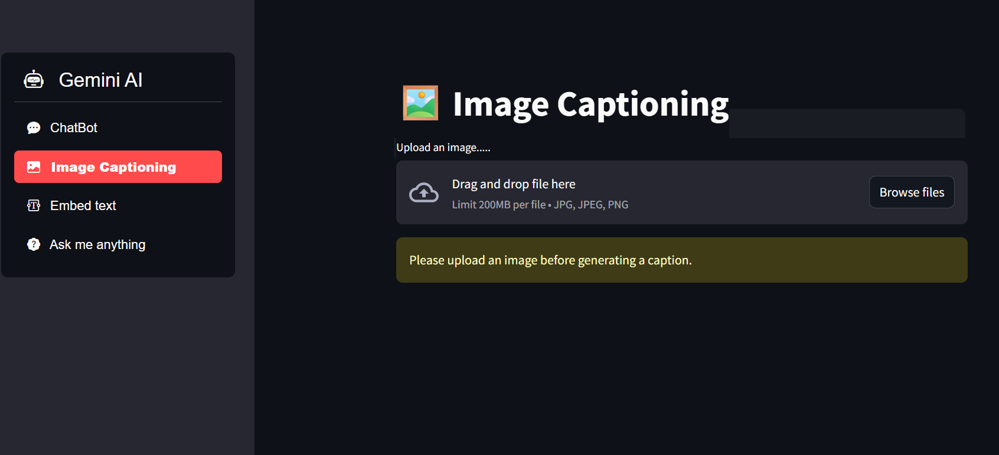
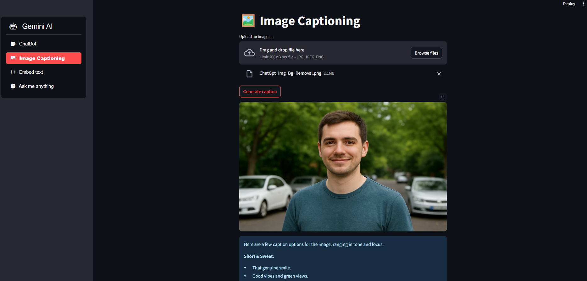
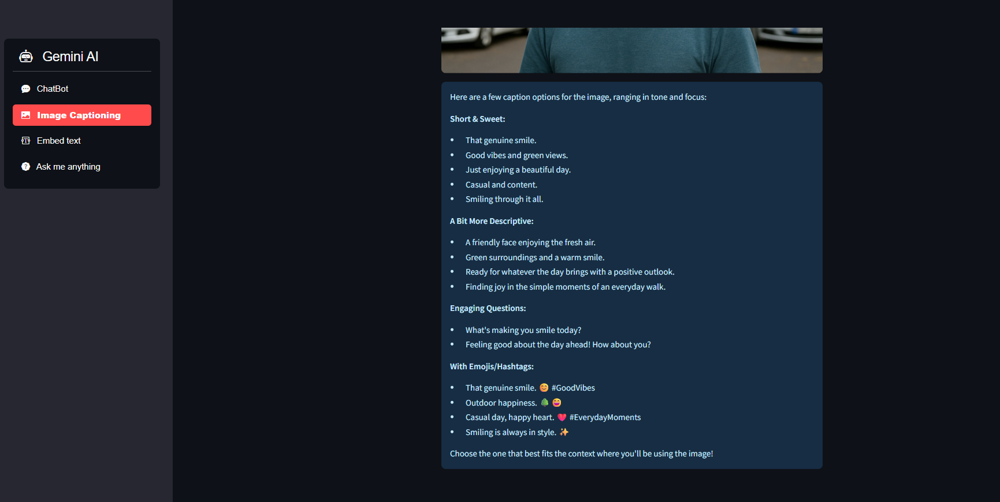
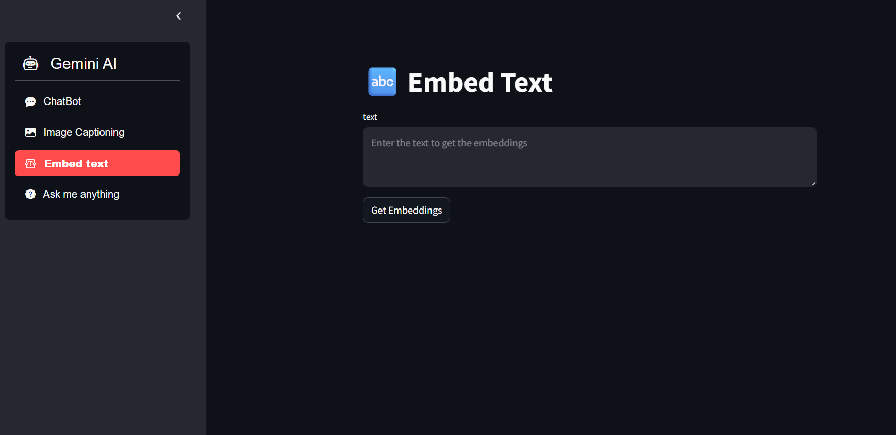
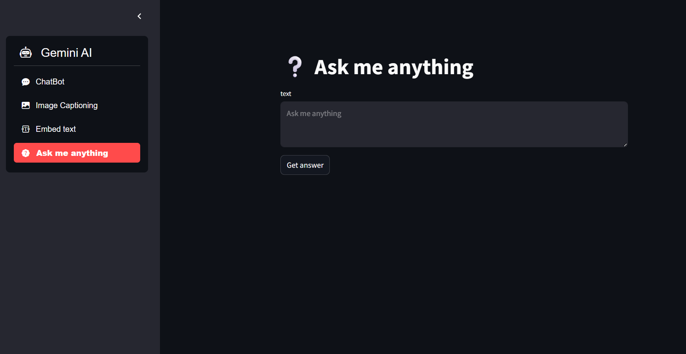

# 🤖 Gemini AI — Streamlit Application

## 📖 Overview
This project is an interactive **Streamlit web application** that integrates with **Google’s Gemini Generative AI models** to provide multiple intelligent utilities — including chatbot interactions, image captioning, text embeddings, and question answering.

The app uses **Google Generative AI API**, **Streamlit**, and **Python** to deliver real-time, AI-powered experiences directly from the browser.

---

## 🚀 Features

### 🧠 1. ChatBot
- Interact with **Gemini 2.0 Flash**, an advanced conversational AI model.
- Maintains conversation history within your Streamlit session.
- Provides contextual, human-like responses.

### 🖼️ 2. Image Captioning
- Upload any image (`.jpg`, `.jpeg`, `.png`) and get an **auto-generated caption**.
- Uses **Gemini 2.5 Flash Vision** model to analyze image content and generate meaningful descriptions.

### 🔤 3. Embed Text
- Converts any input text into **high-dimensional vector embeddings** using the `models/embedding-001` model.
- Useful for applications like **semantic search, retrieval, or similarity comparison**.

### ❔ 4. Ask Me Anything
- Type any question and receive detailed answers powered by **Gemini Flash**.
- Handles both general knowledge and reasoning-type questions.

---

## ⚙️ Tech Stack

| Component | Description |
|------------|-------------|
| **Frontend** | Streamlit |
| **Backend / AI Models** | Google Generative AI (Gemini Models) |
| **Libraries** | `streamlit`, `streamlit-option-menu`, `pillow`, `google-generativeai`, `dotenv` |
| **Language** | Python 3.x |

---

## 🧩 Project Structure

```plaintext
📁 Gemini-App/
│
├── 📄 main.py # Main Streamlit app file
├── 📄 gemini_utility.py # Utility functions for Gemini API calls
├── 📄 .env # Stores the GEMINI_API_KEY
├── 📄 requirements.txt # Dependencies list
└── 🖼️ Screenshots/ # (Optional) Folder for storing uploaded images or screenshots
```

## Images









